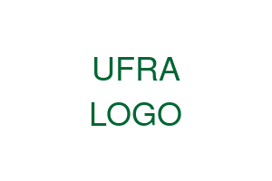

{width=200px fig-align="center"}

\newpage

# Apresentação {.unnumbered}

Este relatório apresenta um panorama das atividades desenvolvidas pelos Cursos Técnicos da Universidade Federal Rural da Amazônia (UFRA), demonstrando os resultados alcançados e as perspectivas para o desenvolvimento futuro dos programas de educação profissional técnica de nível médio.

A UFRA, através de seus cursos técnicos, tem como missão formar profissionais qualificados para atender às demandas do setor agropecuário, ambiental e tecnológico da região amazônica, contribuindo para o desenvolvimento sustentável da região.